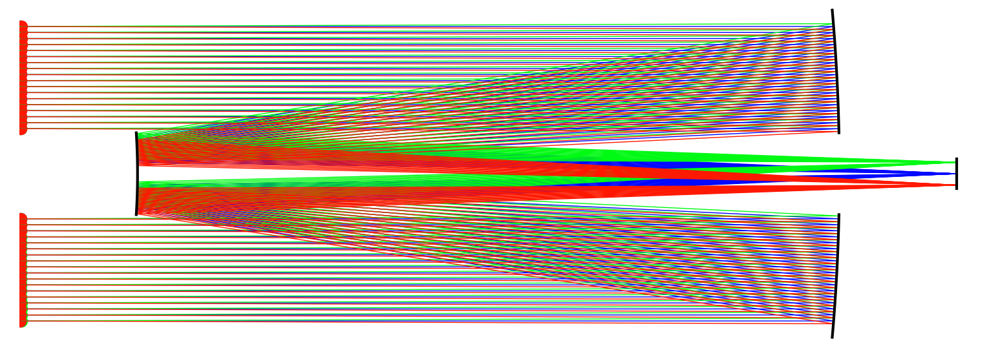

# Opticalpy - Optical raytracing in Python

[](https://pypi.org/project/opticalpy/)

This package in the making offers the possibility to **create optical setup** and **visualize the light rays going through it**.

It originated as a way to better understand how instruments in astronomy worked, and allow to design them for amateur scientific endeavours. However, this package can be used in very different fields !


## What makes this package special ?

1. It allows for modeling setup that use **dispersive elements** (gratings, prism, *grism*), and soon will also take dispersion in lenses into account.

2. The optical elements geometry are **described by parameterized curves** allowing for exact interaction bewteen light rays and optical elements. This gives way better results than using discretized elements. To make this easy to use, each optical element is defined by one set of equations, that are automatically modified to place it where and in the orientation you want. The most common optical elements are already implemented, but you can add whatever you want with the method !



## Installation

This package can be very easily installed using pip :

 ```pip install opticalpy```

## Optical elements

This package integrates the following optical elements. The elements in *italic* aren't developed yet but should be added soon.

* **Mirror**:
    * Flat
    * Parabolic
    * Hyperbolic
    * Spherical

* **Lens**:
    * Spherical
    * *Doublet*
    * *Triplet*

* **Dispersive**:
    * Reflection grating
    * Transmission grating
    * Prism
    * *Grism*

* **Camera**

* **Telescopes**
    * *Newtonian*
    * Cassegrain
    * Ritchey-Chrétien
    * *Schmidt-Cassegrain*
    * *Maksutov-Cassegrain*

## What's coming next ?

* More elements:
    * Materials for dispersive lenses
    * Lenses arrangment (doublet, triplet...)
    * Grisms
    * More telescopes (Newtonian, Schmidt-Cassegrain, Maksutov-Cassegrain)

* Making it easier to use:
    * PyPi package
    * Documentation

* Future version:
    * 3D

## References

* Telescopes formulas : Mike Lockwood, Amateur Telescope Making, http://loptics.com/ATM/index.html
* Optical properties of water : https://en.wikipedia.org/wiki/Optical_properties_of_water_and_ice